# 🔐 AppSec Penetration Testing Lab

> A hands-on application security laboratory featuring an intentionally vulnerable web application, an automated penetration testing framework, and a fully patched reference implementation.


---

## 📑 Table of Contents

- [Overview](#overview)
- [Project Architecture](#-project-architecture)
- [Quick Start](#-quick-start)
- [Vulnerabilities Demonstrated](#-vulnerabilities-demonstrated)
  - [Phase 1 — Application Overview](#phase-1--application-overview)
  - [Phase 2 — Vulnerability Testing](#phase-2--vulnerability-testing)
    - [SQL Injection](#1-sql-injection-cwe-89)
    - [JWT Weak Configuration](#2-jwt-weak-configuration-cwe-347)
    - [IDOR](#3-insecure-direct-object-reference-cwe-639)
    - [CSRF](#4-cross-site-request-forgery-cwe-352)
    - [Reflected XSS](#5-reflected-xss-cwe-79)
    - [Stored XSS](#6-stored-xss-cwe-79)
    - [DOM-based XSS](#7-dom-based-xss-cwe-79)
    - [File Upload](#8-unrestricted-file-upload-cwe-434)
    - [Path Traversal](#9-path-traversal-cwe-22)
    - [XXE Injection](#10-xml-external-entity-injection-cwe-611)
    - [SSRF](#11-server-side-request-forgery-cwe-918)
    - [Mass Assignment](#12-mass-assignment-cwe-915)
    - [Rate Limiting](#13-missing-rate-limiting-cwe-307)
    - [Sensitive Data Exposure](#14-sensitive-data-exposure-cwe-200)
  - [Phase 3 — Automated Security Scanner](#phase-3--automated-security-scanner)
- [Exploit Scripts](#-exploit-scripts)
- [Patched Application](#-patched-application)
- [Final Vulnerability Report](#-final-vulnerability-report)
- [Remediation Summary](#-remediation-summary)
- [Learning Resources](#-learning-resources)
- [Disclaimer](#%EF%B8%8F-disclaimer)

---

## Overview

This project is a complete application security lab built as an educational environment. It contains three core components:

| Component | Description |
|-----------|-------------|
| **Vulnerable App** (`app/`) | Flask web application with 15+ intentional security flaws covering OWASP Top 10 |
| **Testing Framework** (`framework/`) | Automated 5-phase penetration testing pipeline with exploit scripts |
| **Patched App** (`app_patched/`) | Secure reference implementation demonstrating proper fixes |

The lab follows a structured methodology: **Reconnaissance → Enumeration → Scanning → Exploitation → Reporting**, mirroring real-world penetration testing workflows.

---

## 📁 Project Architecture

```
AppSec-Penetration-Testing-Lab/
├── app/                            # Vulnerable web application
│   ├── main.py                     # Application entry point
│   ├── config.py                   # Configuration (hardcoded secrets)
│   ├── database.py                 # Database setup
│   ├── models/                     # SQLAlchemy ORM models
│   │   ├── user.py                 # User model
│   │   ├── transaction.py          # Transaction model
│   │   ├── comment.py              # Comment model
│   │   └── file.py                 # File upload record
│   ├── routes/                     # Route handlers (all vulnerable)
│   │   ├── auth.py                 # Authentication (SQL injection)
│   │   ├── api.py                  # API endpoints (data exposure)
│   │   ├── upload.py               # File upload (no validation)
│   │   ├── payments.py             # Payments (CSRF, SSRF)
│   │   ├── import_data.py          # XML import (XXE)
│   │   ├── admin.py                # Admin panel
│   │   └── main.py                 # Core routes (XSS, IDOR)
│   ├── templates/                  # Jinja2 HTML templates
│   └── static/                     # CSS and assets
│
├── app_patched/                    # Secure version (all fixes applied)
│   ├── main.py                     # Secure entry point
│   ├── routes/                     # Hardened route handlers
│   └── models/                     # Secure models
│
├── framework/                      # Penetration testing framework
│   ├── main.py                     # Framework entry point
│   ├── config.yaml                 # Scanner configuration
│   ├── phases/                     # 5-phase testing pipeline
│   │   ├── _01_reconnaissance.py   # Target discovery
│   │   ├── _02_enumeration.py      # Endpoint enumeration
│   │   ├── _03_scanning.py         # Vulnerability scanning
│   │   ├── _04_exploitation.py     # Automated exploitation
│   │   └── _05_reporting.py        # Report generation
│   ├── exploits/                   # Standalone exploit scripts
│   │   ├── sql_exploit.py          # SQL injection
│   │   ├── jwt_forger.py           # JWT token forgery
│   │   ├── idor_enum.py            # IDOR enumeration
│   │   ├── xss_payloads.py         # XSS payload testing
│   │   ├── file_upload_rce.py      # File upload RCE
│   │   ├── path_traversal.py       # Path traversal
│   │   ├── xxe_injector.py         # XXE injection
│   │   ├── csrf_gen.py             # CSRF PoC generator
│   │   ├── ssrf_rebind.py          # SSRF exploitation
│   │   └── mass_assign.py          # Mass assignment
│   ├── nuclei_templates/           # Nuclei vulnerability templates
│   ├── utils/                      # Helper utilities
│   └── reporting/                  # Report generators (PDF, HTML)
│
├── screenshot/                     # Vulnerability demonstration screenshots
├── docs/                           # Additional documentation
├── docker-compose.yml              # Docker orchestration
├── Dockerfile                      # Container build file
├── requirements.txt                # Python dependencies
└── .env.example                    # Environment variable template
```

---

## 🚀 Quick Start

### Prerequisites

- Python 3.9+
- Docker & Docker Compose (recommended)
- pip

### Option 1: Docker (Recommended)

```bash
# Clone the repository
git clone https://github.com/AhmedIshtiakNihal/AppSec-Penetration-Testing-Lab.git
cd AppSec-Penetration-Testing-Lab

# Copy environment file
cp .env.example .env

# Build and start containers
docker-compose up --build -d

# Application runs at http://localhost:5005
```

### Option 2: Local Setup

```bash
# Install dependencies
pip install -r requirements.txt

# Run the vulnerable application (SQLite)
export DATABASE_URL=sqlite:///vulnerable.db
python3 -m app.main

# Application runs at http://localhost:5000
```

### Running the Security Framework

```bash
# Run all phases (reconnaissance → exploitation → reporting)
PYTHONPATH=. python3 framework/main.py --target http://localhost:5005 --run-all

# Output saved to framework/output/
```

### Default Test Credentials

| Username | Password | Role |
|----------|----------|------|
| `admin` | `admin123` | Administrator |
| `alice` | `alice123` | Regular User |
| `bob` | `bob123` | Regular User |

---

## 🔍 Vulnerabilities Demonstrated

### Phase 1 — Application Overview

The lab presents itself as a **FinTech Demo Portal** with features like payments, statements, file uploads, and an admin console.

**Homepage:**

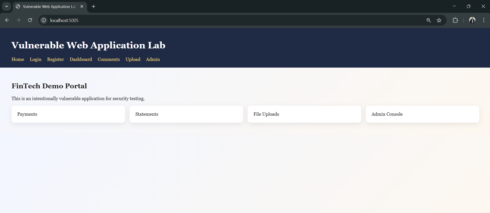

**Login Form:**

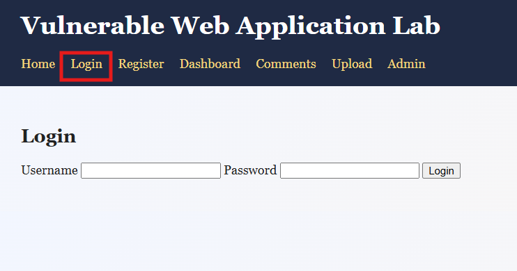

---

### Phase 2 — Vulnerability Testing

#### 1. SQL Injection (CWE-89)

**Severity:** 🔴 Critical | **OWASP:** A03:2021 — Injection

SQL injection occurs when user input is directly concatenated into SQL queries without sanitization. The login form constructs queries using string formatting:

```python
# Vulnerable code
query = f"SELECT * FROM users WHERE username='{username}' AND password='{password}'"
```

**Attack:** Enter `admin' OR '1'='1` as the username to bypass authentication entirely.

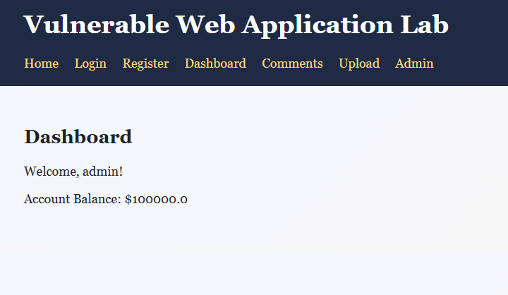

The raw SQL query is exposed in error messages, revealing database structure:

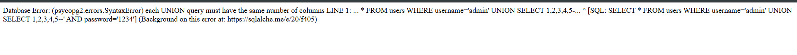

---

#### 2. JWT Weak Configuration (CWE-347)

**Severity:** 🔴 Critical | **OWASP:** A02:2021 — Cryptographic Failures

The application uses a hardcoded JWT secret (`dev-jwt-secret`) and accepts tokens with the `none` algorithm. This allows attackers to forge arbitrary admin tokens.

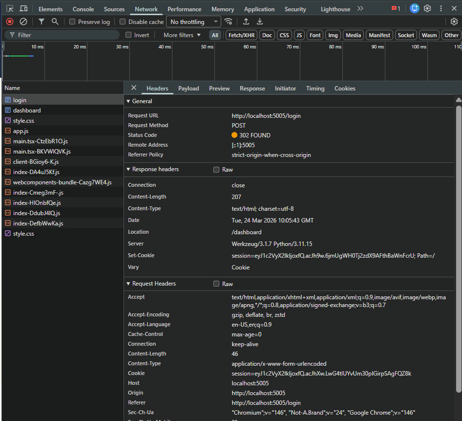

---

#### 3. Insecure Direct Object Reference (CWE-639)

**Severity:** 🟠 High | **OWASP:** A01:2021 — Broken Access Control

User profiles are accessible by simply changing the user ID in the URL (`/user/1`, `/user/2`, etc.) without any authentication or authorization check. Sensitive data including API keys is exposed.

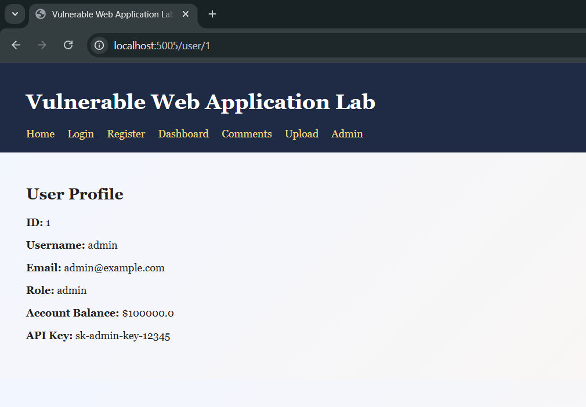

---

#### 4. Cross-Site Request Forgery (CWE-352)

**Severity:** 🟠 Medium | **OWASP:** A01:2021 — Broken Access Control

The `/transfer` endpoint processes fund transfers without CSRF token validation. An attacker can craft a hidden HTML form that auto-submits when a victim visits the page:

```html
<form action="http://target/transfer" method="POST" style="display:none;">
    <input type="hidden" name="recipient" value="attacker@evil.com">
    <input type="hidden" name="amount" value="1000000">
</form>
<script>document.forms[0].submit();</script>
```

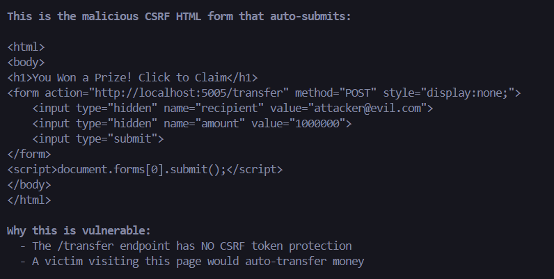

---

#### 5. Reflected XSS (CWE-79)

**Severity:** 🔴 High | **OWASP:** A03:2021 — Injection

The search endpoint reflects user input directly into the HTML response without encoding:

```
/search?q=<script>alert('XSS')</script>
```

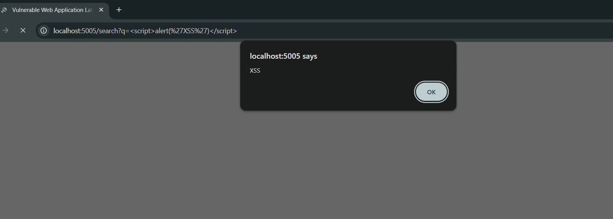

---

#### 6. Stored XSS (CWE-79)

**Severity:** 🔴 High | **OWASP:** A03:2021 — Injection

The comments feature uses `{{ comment.text | safe }}` in templates, rendering HTML without escaping. Malicious scripts persist in the database and execute for every visitor:

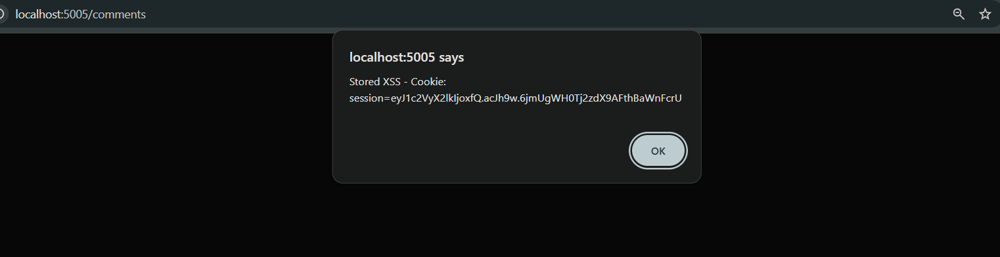

---

#### 7. DOM-based XSS (CWE-79)

**Severity:** 🟠 Medium | **OWASP:** A03:2021 — Injection

Client-side JavaScript vulnerabilities allow DOM manipulation. Cookies are accessible via `document.cookie` because `SESSION_COOKIE_HTTPONLY` is set to `False`:

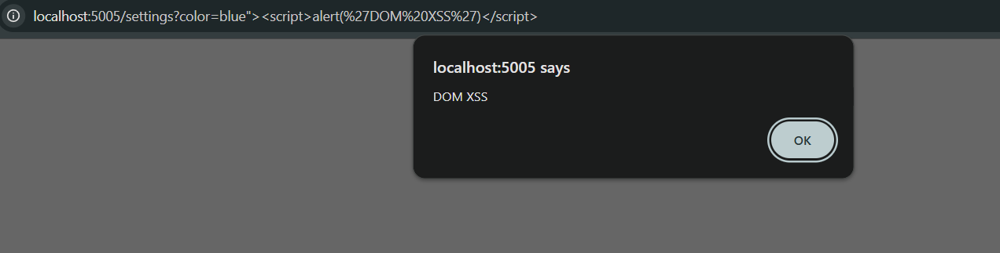

---

#### 8. Unrestricted File Upload (CWE-434)

**Severity:** 🔴 Critical | **OWASP:** A04:2021 — Insecure Design

The upload endpoint accepts any file type without validation — no extension filtering, no content-type checks, no file size limits. Uploaded files are served directly:

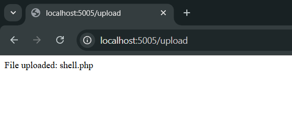

---

#### 9. Path Traversal (CWE-22)

**Severity:** 🔴 High | **OWASP:** A01:2021 — Broken Access Control

The download endpoint uses `os.path.join()` without sanitizing path traversal sequences. Attackers can read arbitrary server files:

```
/download?file=../../../../etc/passwd
```

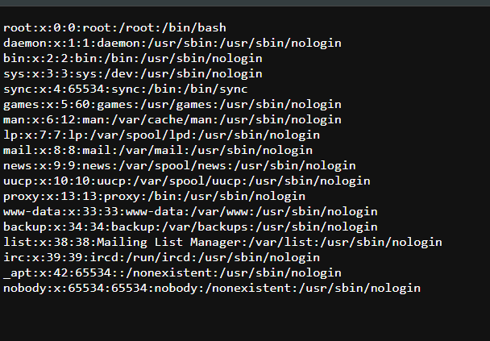

---

#### 10. XML External Entity Injection (CWE-611)

**Severity:** 🔴 High | **OWASP:** A05:2021 — Security Misconfiguration

The XML import endpoint parses XML with external entity resolution enabled (`resolve_entities=True`). This allows file exfiltration:

```xml
<?xml version="1.0"?>
<!DOCTYPE foo [<!ENTITY xxe SYSTEM "file:///etc/passwd">]>
<request><user>&xxe;</user></request>
```

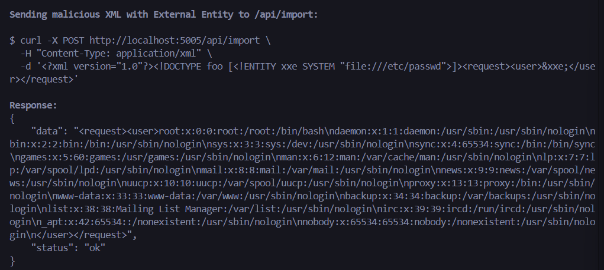

---

#### 11. Server-Side Request Forgery (CWE-918)

**Severity:** 🟠 High | **OWASP:** A10:2021 — SSRF

The `/fetch` endpoint makes HTTP requests to any URL provided by the user, including internal services, cloud metadata endpoints, and localhost:

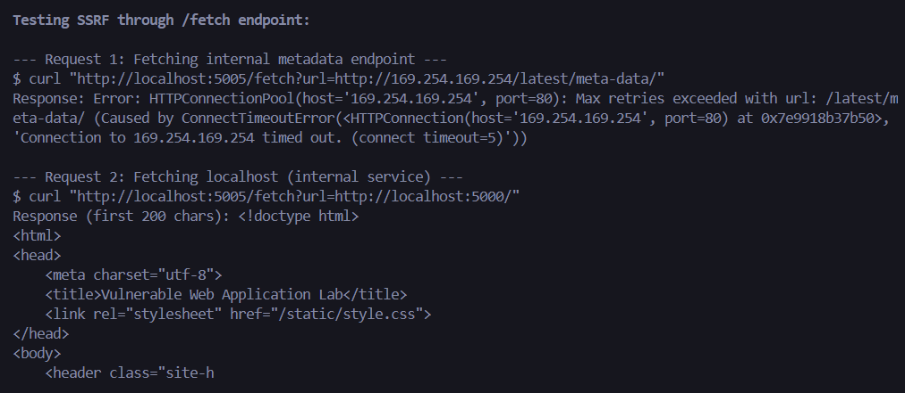

---

#### 12. Mass Assignment (CWE-915)

**Severity:** 🟠 Medium | **OWASP:** A04:2021 — Insecure Design

The profile update endpoint iterates over all submitted fields using `setattr()` without an allowlist. Attackers can escalate privileges by adding `"role": "admin"` to the request:

```python
# Vulnerable code
for key, value in request.json.items():
    if hasattr(user, key):
        setattr(user, key, value)  # Sets ANY field, including 'role'
```

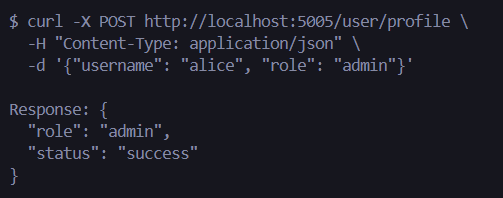

---

#### 13. Missing Rate Limiting (CWE-307)

**Severity:** 🟡 Medium | **OWASP:** A07:2021 — Identification and Authentication Failures

The login endpoint has no rate limiting or account lockout. An attacker can send unlimited login attempts for brute-force attacks:

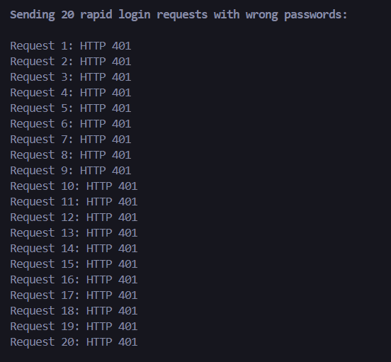

---

#### 14. Sensitive Data Exposure (CWE-200)

**Severity:** 🔴 High | **OWASP:** A02:2021 — Cryptographic Failures

The `/api/users` endpoint returns complete user records including plaintext passwords and API keys with no authentication required:

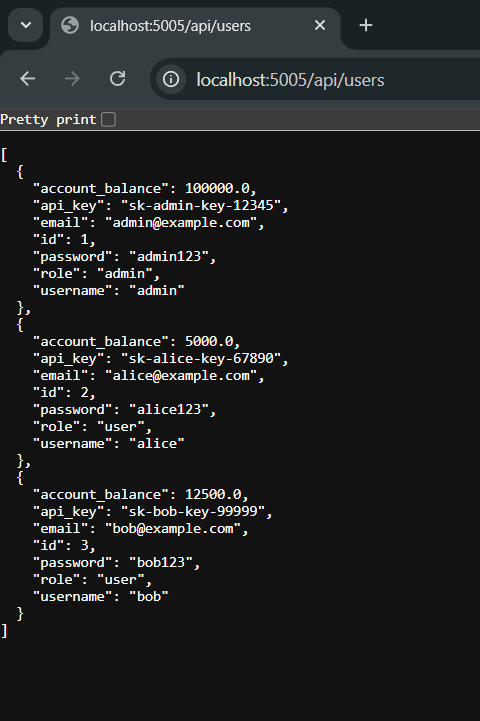

---

### Phase 3 — Automated Security Scanner

The framework runs a 5-phase penetration testing pipeline:

1. **Reconnaissance** — Target discovery and server fingerprinting
2. **Enumeration** — Endpoint and technology enumeration
3. **Scanning** — Automated vulnerability checks
4. **Exploitation** — Active exploitation of discovered vulnerabilities
5. **Reporting** — PDF and HTML report generation

**Scanner Execution:**

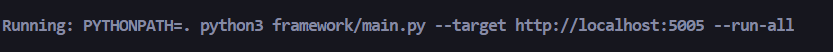

**Scan Results:**

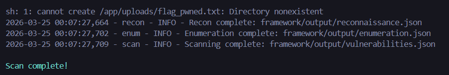

**Generated Output Files:**

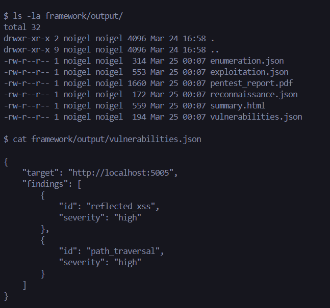

---

## 🛠 Exploit Scripts

Each exploit is a standalone Python script in `framework/exploits/` that can be run independently.

#### SQL Injection Exploit
Bypasses authentication using `admin' OR '1'='1` payload.

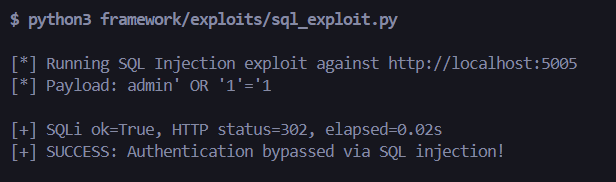

#### JWT Token Forger
Crafts admin JWT tokens using the `none` algorithm bypass.

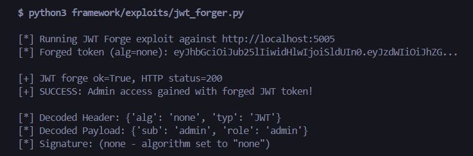

#### IDOR Enumeration
Iterates through user IDs to discover accessible profiles without authentication.

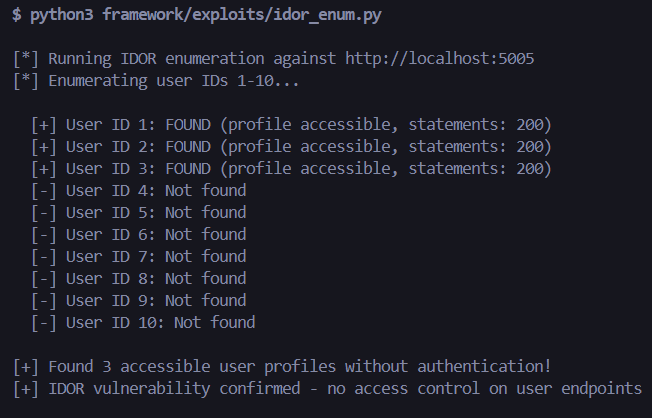

#### XSS Payload Scanner
Tests multiple XSS vectors including `<script>`, ``, `<svg/onload>`, and more.

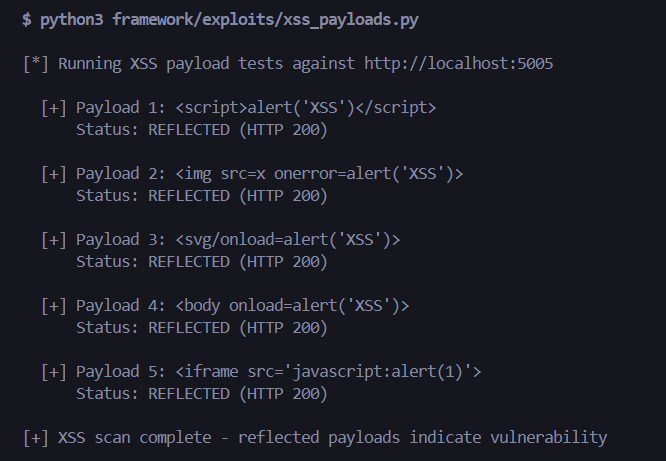

#### File Upload RCE
Uploads a PHP webshell to demonstrate unrestricted file upload.

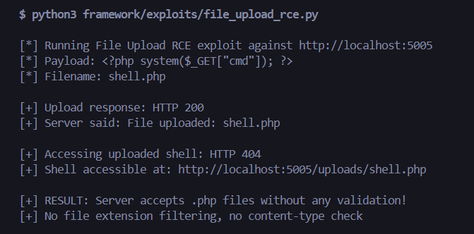

#### Path Traversal Exploit
Reads arbitrary files from the server using `../../` sequences.

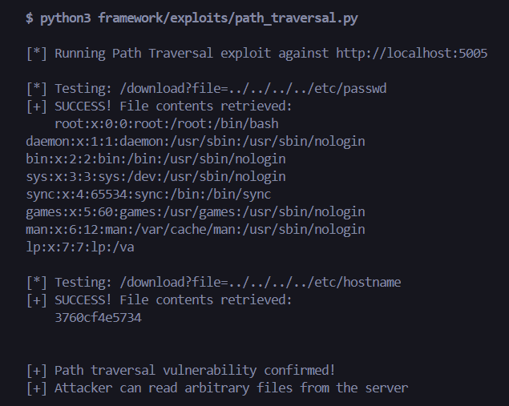

#### XXE Injection
Extracts `/etc/passwd` via XML External Entity injection.

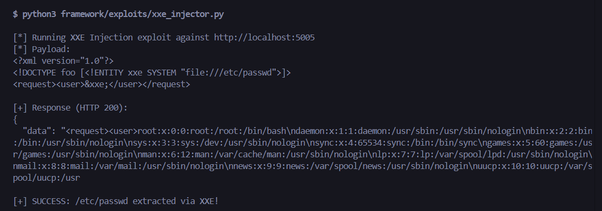

#### CSRF PoC Generator
Generates an HTML page that auto-submits a hidden transfer form.

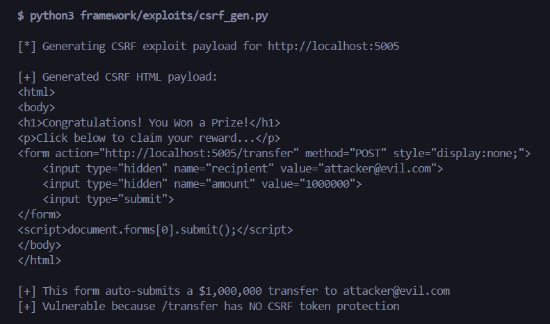

#### SSRF Exploitation
Probes internal services and cloud metadata endpoints via the `/fetch` endpoint.

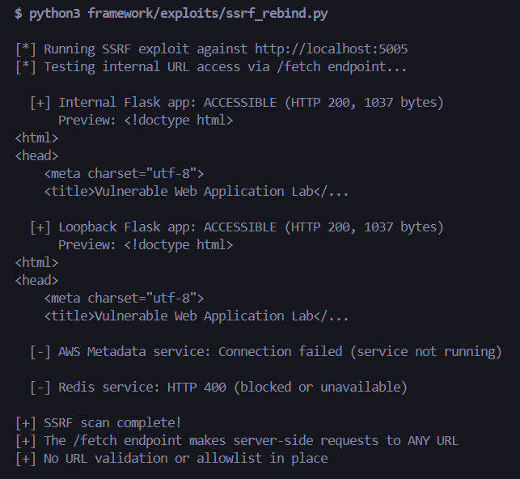

#### Mass Assignment
Escalates user privileges by injecting `role=admin` into profile updates.

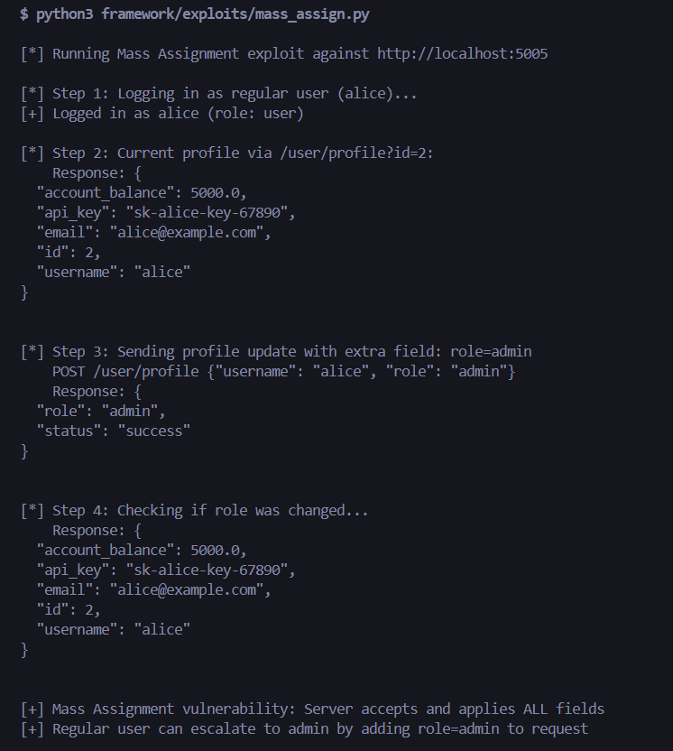

---

## 🛡 Patched Application

The `app_patched/` directory contains a fully secured version with all vulnerabilities remediated. Key differences:

| Vulnerability | Vulnerable App | Patched App |
|--------------|----------------|-------------|
| SQL Injection | String concatenation | Parameterized queries (ORM) |
| XSS | `\| safe` filter | Auto-escaping enabled |
| CSRF | No token | CSRF token validation |
| JWT | `none` algorithm accepted | HS256 enforced with strong secret |
| File Upload | No validation | Extension allowlist + content-type check |
| Path Traversal | Direct `os.path.join` | Path normalization + directory restriction |
| XXE | Entity resolution enabled | External entities disabled |
| SSRF | No URL filtering | Private IP blocklist |
| Cookies | `HttpOnly=False`, `Secure=False` | `HttpOnly=True`, `Secure=True` |
| Rate Limit | None | Account lockout after 5 attempts |

```bash
# Run the patched version
export DATABASE_URL=sqlite:///patched.db
PYTHONPATH=. python3 -m app_patched.main
# Runs on http://localhost:5001
```

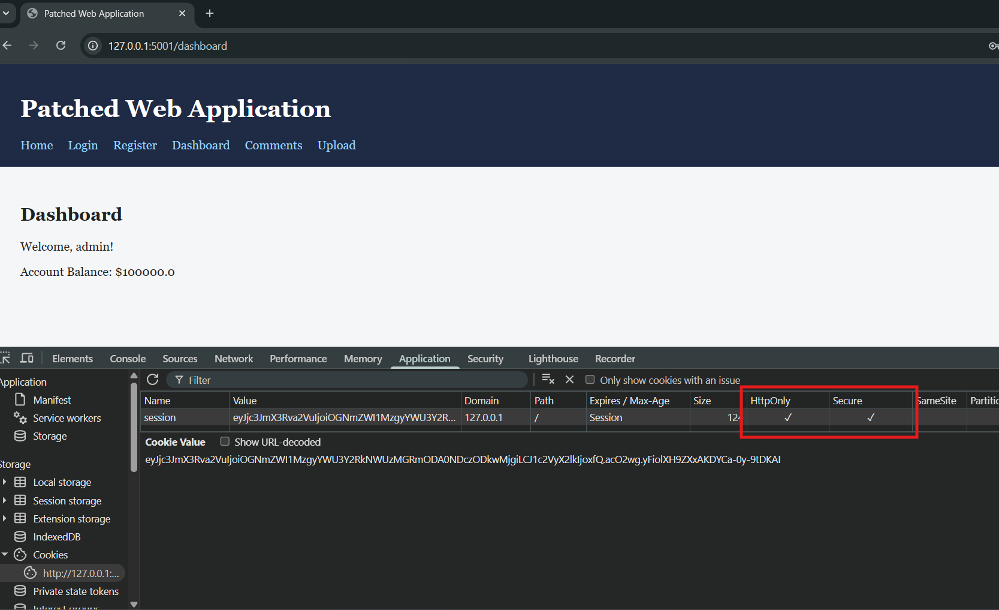

---

## 📊 Final Vulnerability Report

The framework generates a comprehensive report after scanning. Summary of all findings:

| # | Vulnerability | Severity | CWE | OWASP Category |
|---|--------------|----------|-----|----------------|
| 1 | SQL Injection | 🔴 Critical | CWE-89 | A03 — Injection |
| 2 | JWT None Algorithm | 🔴 Critical | CWE-347 | A02 — Cryptographic Failures |
| 3 | Unrestricted File Upload | 🔴 Critical | CWE-434 | A04 — Insecure Design |
| 4 | Reflected XSS | 🔴 High | CWE-79 | A03 — Injection |
| 5 | Stored XSS | 🔴 High | CWE-79 | A03 — Injection |
| 6 | XXE Injection | 🔴 High | CWE-611 | A05 — Security Misconfiguration |
| 7 | Path Traversal | 🔴 High | CWE-22 | A01 — Broken Access Control |
| 8 | Sensitive Data Exposure | 🔴 High | CWE-200 | A02 — Cryptographic Failures |
| 9 | IDOR | 🟠 High | CWE-639 | A01 — Broken Access Control |
| 10 | SSRF | 🟠 High | CWE-918 | A10 — SSRF |
| 11 | CSRF | 🟠 Medium | CWE-352 | A01 — Broken Access Control |
| 12 | Mass Assignment | 🟠 Medium | CWE-915 | A04 — Insecure Design |
| 13 | DOM-based XSS | 🟠 Medium | CWE-79 | A03 — Injection |
| 14 | Missing Rate Limiting | 🟡 Medium | CWE-307 | A07 — Auth Failures |
| 15 | Hardcoded Secrets | 🟡 Medium | CWE-798 | A05 — Security Misconfiguration |

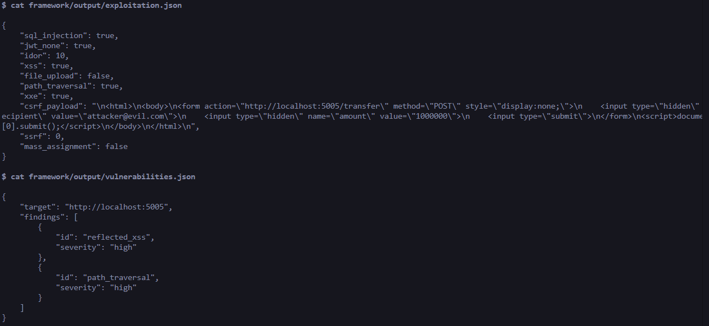

---

## 🔧 Remediation Summary

| Vulnerability | Fix Applied |
|--------------|-------------|
| SQL Injection | Replaced string concatenation with ORM parameterized queries |
| JWT None Algorithm | Enforced HS256 algorithm and signature verification |
| IDOR | Added ownership checks on every user resource endpoint |
| XSS (all types) | Removed `\| safe`, enabled auto-escaping, set `HttpOnly` cookies |
| File Upload | Extension allowlist, content-type validation, file renaming |
| Path Traversal | Path normalization and restricted downloads to upload directory |
| XXE | Disabled external entity resolution and DTD loading |
| SSRF | Blocked private IP ranges and internal hostnames |
| CSRF | Enforced CSRF token validation on all state-changing endpoints |
| Mass Assignment | Implemented field allowlist for user-modifiable attributes |
| Rate Limiting | Added account lockout after 5 failed attempts |
| Sensitive Data | Removed passwords and API keys from API responses |
| Hardcoded Secrets | Moved secrets to environment variables with strong defaults |

For detailed remediation guidance, see [`docs/REMEDIATION_GUIDE.md`](docs/REMEDIATION_GUIDE.md).

---

## 📚 Learning Resources

| Resource | Link |
|----------|------|
| OWASP Top 10 (2021) | https://owasp.org/www-project-top-ten/ |
| OWASP Testing Guide | https://owasp.org/www-project-web-security-testing-guide/ |
| MITRE ATT&CK | https://attack.mitre.org/ |
| MITRE CWE | https://cwe.mitre.org/ |
| CVSS v3.1 Calculator | https://www.first.org/cvss/calculator/3.1 |
| PortSwigger Web Security Academy | https://portswigger.net/web-security |
| HackTricks | https://book.hacktricks.wiki/ |

---

## ⚠️ Disclaimer

```
╔══════════════════════════════════════════════════════════════════╗
║                        ⚠️  WARNING  ⚠️                           ║
║                                                                  ║
║  This application contains INTENTIONAL security vulnerabilities  ║
║  for EDUCATIONAL and AUTHORIZED TESTING purposes ONLY.           ║
║                                                                  ║
║  • DO NOT deploy to production or public-facing servers          ║
║  • DO NOT use techniques learned here against unauthorized       ║
║    systems — this is illegal in most jurisdictions               ║
║  • Use ONLY in isolated local development environments           ║
║  • The patched version (app_patched/) demonstrates proper fixes  ║
║                                                                  ║
╚══════════════════════════════════════════════════════════════════╝
```

---

**Built for educational purposes. Use responsibly and only in authorized testing environments.**
